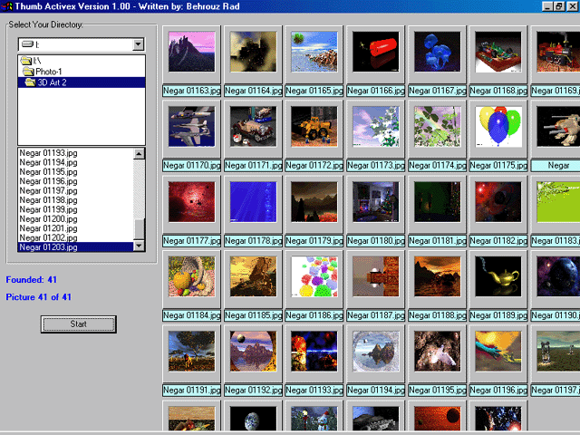



## an Activex For Thumbital Views of Pictures

### Description

This is an Activex Control For Thumbital Views of Pictures.

Very Flexible and very powerful to use.

This is very like to ACD SEE Program's Browser.

a Screen shot and an example program is also included in this package.

please Rate it.
 
### More Info
 

             |
---                |---
**Submitted On**   |2003-12-13 10:02:36
**By**             |[Behrouz Rad](https://github.com/Planet-Source-Code/PSCIndex/blob/master/ByAuthor/behrouz-rad.md)
**Level**          |Advanced
**User Rating**    |4.7 (47 globes from 10 users)
**Compatibility**  |VB 3\.0, VB 4\.0 \(16\-bit\), VB 4\.0 \(32\-bit\), VB 5\.0, VB 6\.0
**Category**       |[OLE/ COM/ DCOM/ Active\-X](https://github.com/Planet-Source-Code/PSCIndex/blob/master/ByCategory/ole-com-dcom-active-x__1-29.md)
**World**          |[Visual Basic](https://github.com/Planet-Source-Code/PSCIndex/blob/master/ByWorld/visual-basic.md)
**Archive File**   |[an\_Activex1697131202004\.zip](https://github.com/Planet-Source-Code/behrouz-rad-an-activex-for-thumbital-views-of-pictures__1-51138/archive/master.zip)

